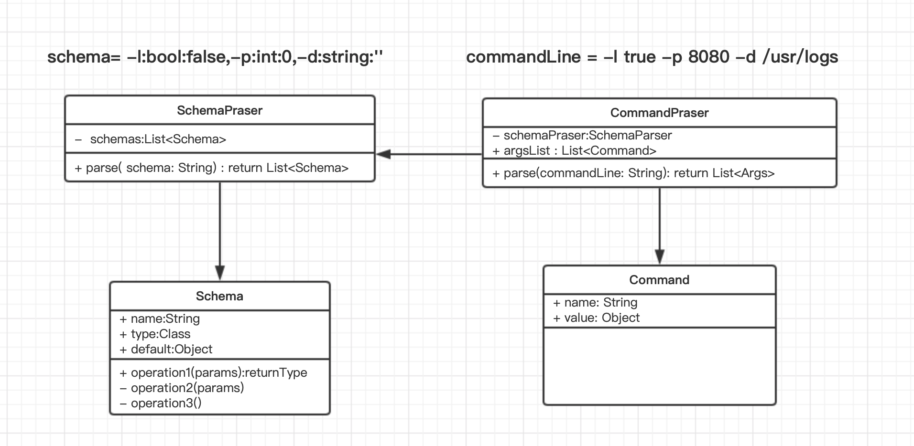

第一个任务很简单：做一遍Args这道题。

做题要求
  1. 看懂题目，开始编码之前先花10分钟拆解任务，把任务清单写下来

  2. 计时，开始编码

  3. 要求用TDD的方式实现：先写测试，后写代码

如果超过90分钟还没完成，就先暂停。我们还需要留出一点时间来反思。

## 1.拆解任务清单

规定:  
> **-l:bool,-p:int,-d:string**

| 输入用例                     | 输出用例                          | 说明                                                     |
| ---------------------------- | --------------------------------- | -------------------------------------------------------- |
| -l true -p 8080 -d /usr/logs | l=true p=8080 d=/usr/logs |                                                          |
| -l -p -d                     | l=false p=0 d=""          | 即如果缺省需要有默认值                                   |
| -l true -p 8080 -d 666       | -d 参数不合法 只能为字符串型   | 需要保证各个参数类型符合:  -l:true,-p:int,-d:string |

索性我们规定schema的格式为:  [参数名:参数类型:参数默认值]

> -l:bool:false,-p:int:0,-d:string:""

### 代码结构设计

ps: 耗时1小时

##   2. 计时，开始编码
编码完成,真实代码结构如下:

ps 耗时 3小时(断断续续...)

反思
  - 做完整道题用了多长时间？
  
  > 一共做下来花了4小时左右

  - 代码质量怎么样？
  
  > 再开始编码前,简单分析了下需求,设计了代码结构, 代码质量感觉一般

  - TDD的方式顺畅吗？
  
  > TDD 方式还是不太会用, 在写核心逻辑的时候,很容易出错,debug了好久,想来还是测试不够全面, 没有自己的 tdd 开发节奏
  > 整个项目做下来,更感觉自己是为了tdd 而 tdd,经常是写完代码回来补个测试...

  - 实际做的步骤，和一开始拆分的任务是否相同？
  
  > 实际做的时候逼分解任务考虑的更全面, 但经常陷入细节之中,忘记 tdd, 